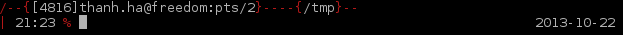
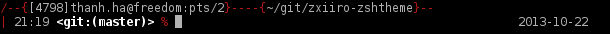
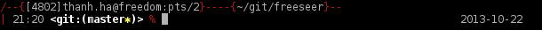
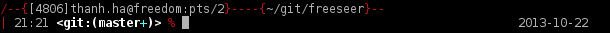

zxiiro-zshtheme
===============

My personal zsh theme

This theme is meant to be used with oh-my-zsh. Simply copy the file
zxiiro.zsh-theme to your oh-my-zsh themes directory. (Usually
~/.oh-my-zsh/themes)

Regular prompt:

Git Prompt:

Git Prompt with changes:

Git Prompt with deleted files:

Git Prompt with renamed files:

Git Prompt with staged files:

Git Prompt with untracked files:

